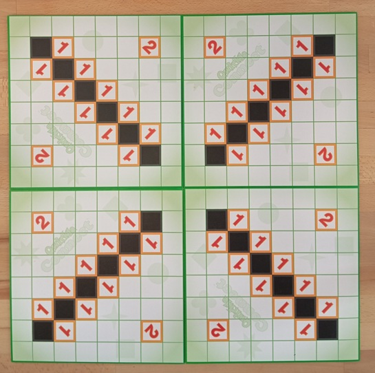
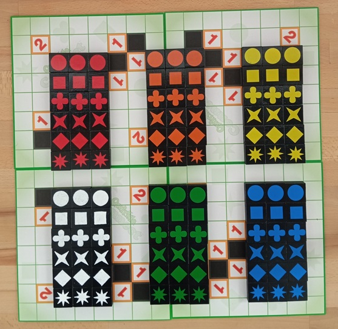

# Qwirkle Connect Auto Scorer

Automatic move detection and score calculation system for the Qwirkle Connect board game using Computer Vision techniques.

## Table of Contents
- [Introduction](#introduction)
- [About Qwirkle Connect](#about-qwirkle-connect)
- [Features](#features)
- [How It Works](#how-it-works)
  - [Board Extraction](#1-board-extraction)
  - [Piece Shape Detection](#2-piece-shape-detection)
  - [Color Detection](#3-color-detection)
  - [Bonus Management](#4-bonus-management)
  - [Score Calculation](#5-score-calculation)
- [Usage](#usage)
- [Output Format](#output-format)
- [Algorithm Details](#algorithm-details)
- [Observations and Limitations](#observations-and-limitations)
- [Author](#author)

## Introduction

This project implements an automated image processing system for the Qwirkle Connect game. The system extracts the game board from photographs, detects the current configuration (shapes and colors of pieces), identifies newly placed pieces, and calculates the score obtained.

## About Qwirkle Connect

Qwirkle Connect is a strategic tile-placement board game where players score points by creating lines of matching attributes.

### Game Components

- **Board**: 16×16 grid with bonus squares (+1 and +2 points)
- **Pieces**: 108 tiles with unique combinations of:
  - **6 Shapes**: Circle, Clover, Diamond, Square, 4-point Star, 8-point Star
  - **6 Colors**: White, Red, Orange, Yellow, Green, Blue
  - Each shape-color combination appears 3 times in the game

  



### How to Play

1. **Objective**: Score the most points by placing tiles on the board to form lines
2. **Placement Rules**: 
   - Tiles must be placed in lines (horizontal or vertical)
   - All tiles in a line must share either the same shape OR the same color
   - All tiles in a line must be different in the non-matching attribute
   - Example valid line: Red Circle, Red Square, Red Star (same color, different shapes)
   - Example invalid line: Red Circle, Blue Circle, Red Square (neither all same color nor all same shape)

3. **Scoring**:
   - **Base Score**: Each line scores points equal to its length (number of tiles)
   - **Multiple Lines**: If a placed tile completes multiple lines, score each line separately
   - **Qwirkle Bonus**: Completing a line of 6 tiles (maximum possible) earns a +6 point bonus
   - **Bonus Squares**: Landing on +1 or +2 bonus squares adds extra points (one-time use)


## Features

- **Automatic Board Extraction**: Perspective correction using green border detection
- **Shape Recognition**: Template matching for 6 different piece shapes
- **Color Identification**: HSV-based color detection for 6 colors
- **Bonus Tracking**: Automatic management of +1 and +2 bonus squares
- **Score Calculation**: Accurate scoring following Qwirkle Connect rules
- **Move Detection**: Identification of newly placed pieces between consecutive states


## How It Works

### 1. Board Extraction

The Qwirkle Connect board has a distinctive green frame that serves as a reference for extraction:

1. **HSV Conversion**: The image is converted from BGR to HSV for more robust green color segmentation
2. **Color-based Segmentation**: A binary mask is created using the HSV range `[35, 30, 30]` - `[85, 255, 255]` for green shades
3. **Morphological Dilation**: The mask is dilated with an 85×85 kernel to fill gaps and connect regions
4. **Corner Detection**: The 4 extreme corners of the board are identified using coordinate sum and difference:
   - Top-left corner: `min(x + y)`
   - Bottom-right corner: `max(x + y)`
   - Top-right corner: `min(x - y)`
   - Bottom-left corner: `max(x - y)`
5. **Perspective Transformation**: A transformation matrix is applied to map the 4 corners to a perfect 1600×1600 pixel square

A 25-pixel padding is added around the board to facilitate subsequent processing of edge cells.

### 2. Piece Shape Detection

The main method for identifying the piece type in each cell is **template matching**:

1. **Template Preparation**: Template images are created for each shape in grayscale, normalized to the range `[0, 255]`
2. **Padding Cleanup**: To reduce false detections caused by noise at cell edges, the `clean_padding` function overwrites pixels in the padding regions (25px) where no pieces are located with a lighter value (200)
3. **Cell Extraction**: The board is divided into 16×16 cells of 100×100 pixels each. For each cell, a patch with additional padding is extracted for better piece identification
4. **Normalization**: Both the patch and templates are normalized
5. **Template Comparison**: `cv.matchTemplate` is applied with the `TM_CCOEFF_NORMED` method, which returns a normalized correlation score between `[-1, 1]`
6. **Best Match Selection**: The template with the maximum score is chosen as the detected shape
7. **Decision Threshold**: If the maximum score is below `0.65`, the cell is considered empty

### 3. Color Detection

After identifying the shape, it's necessary to determine the color of each piece. Color detection is sensitive to lighting variations, which is why the HSV space is preferred over RGB.

Specific HSV ranges are defined for each game color:

- **White (W)**: H:`[0-180]`, S:`[0-60]`, V:`[100-255]` - low saturation, high brightness
- **Red (R)**: H:`[0-5]` and `[175-180]`, S:`[120-255]`, V:`[50-255]` - split range due to Hue cyclicity
- **Orange (O)**: H:`[5-20]`, S:`[70-255]`, V:`[50-255]`
- **Yellow (Y)**: H:`[26-40]`, S:`[50-255]`, V:`[50-255]`
- **Green (G)**: H:`[41-90]`, S:`[50-255]`, V:`[50-255]`
- **Blue (B)**: H:`[91-130]`, S:`[50-255]`, V:`[50-255]`

For each cell containing a piece (not empty or bonus):

1. The corresponding patch is extracted
2. Converted to HSV
3. Each color range is tested and the percentage of pixels falling within that range is calculated
4. The color with the highest score is assigned to the piece

The final label of a piece becomes the shape-color combination (e.g., `"1R"` for red circle).

### 4. Bonus Management

The Qwirkle Connect board contains fixed bonuses placed in 4 symmetric quadrants. Each quadrant has:

- **2 cells with +2 bonus** (in opposite corners)
- **10 cells with +1 bonus** (on the diagonal between the two corners)

Bonuses are manually added to the initial matrix and transferred between consecutive moves until a piece is placed on that position.

### 5. Score Calculation

The score of a move is calculated based on the difference between the previous and current configuration:

1. **Identifying New Pieces**: The two matrices are compared and cells that have transitioned from empty/bonus to occupied are identified
2. **Line Extension**: For each new piece, lines are extended horizontally and vertically until encountering an empty space or edge
3. **Avoiding Double Counting**: A set of processed lines is used to avoid counting the same line twice (when two new pieces are on the same line)
4. **Score per Line**:
   - Base score = line length
   - Qwirkle bonus: +6 points if the line contains exactly 6 pieces
   - Position bonuses: +1 or +2 for new pieces placed on bonus cells
5. **Total Score**: Sum of scores from all formed lines

## Usage

```bash
python main.py
```

The script processes 5 games, each with 20 moves (100 images total), reading from the `testare/` directory and outputting results to the specified output directory.

## Output Format

For each move image, the system generates a `.txt` file containing:

```
[Row][Column] [Shape][Color]
[Row][Column] [Shape][Color]
...
[Total Score]
```

**Example:**
```
5C 4R
5D 3Y
8
```

This indicates:
- Square-Red piece placed at position 5C
- Diamond-Yellow piece placed at position 5D
- Total score: 8 points

### Piece Encoding

**Shapes:**
- `1` = Circle
- `2` = Clover
- `3` = Diamond
- `4` = Square
- `5` = 4-point Star
- `6` = 8-point Star

**Colors:**
- `W` = White
- `R` = Red
- `O` = Orange
- `Y` = Yellow
- `G` = Green
- `B` = Blue

## Algorithm Details

### Corner Detection Algorithm

```python
# Extreme point detection using coordinate operations
top_left = pts[np.argmin(sums)]       # minimum x+y
bottom_right = pts[np.argmax(sums)]   # maximum x+y
top_right = pts[np.argmin(diffs)]     # minimum x-y
bottom_left = pts[np.argmax(diffs)]   # maximum x-y
```

### Template Matching

All templates and patches are normalized using `cv.NORM_MINMAX` before comparison to ensure consistent matching across varying lighting conditions.

### Line Extension

The system efficiently finds all horizontal and vertical lines containing newly placed pieces. It uses unique keys `(direction, position, start, end)` to track processed line segments and avoid duplicate scoring.

## Observations and Limitations

Although the system generally works well, some situations have been identified where detection errors occur. Occasionally, template matching hallucinates non-existent pieces:

- **Circles** in empty central areas
- **Squares** on board edges

These false positives are caused by:
- Noise in padding regions
- Similar patterns in empty cells
- Lighting variations creating shape-like shadows

**Future improvements:**
- Adaptive thresholding for varying lighting conditions
- Deep learning-based piece detection for improved robustness
- Enhanced false positive filtering
- Support for different camera angles and distances

## Author

**Cochior Iulia-Ștefana**  
Group 344  
Computer Vision Project

---

*For questions or issues, please open an issue on GitHub.*
